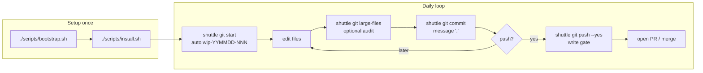
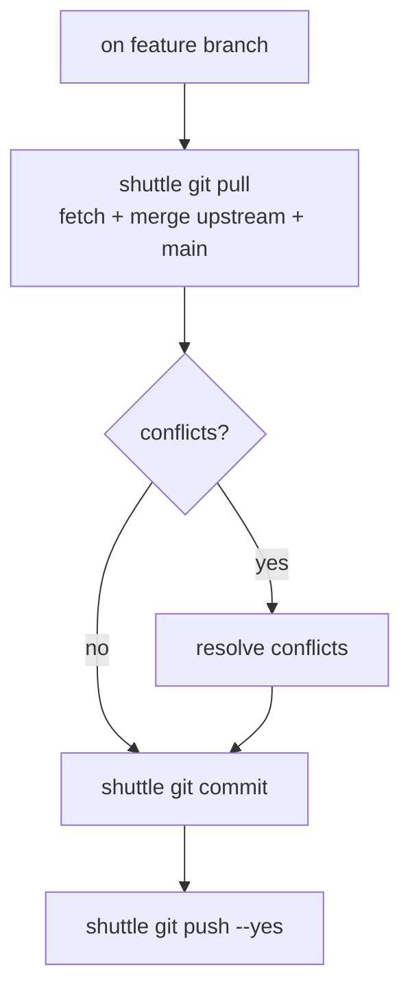
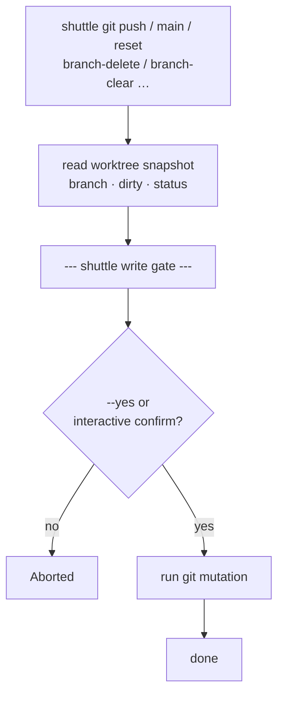
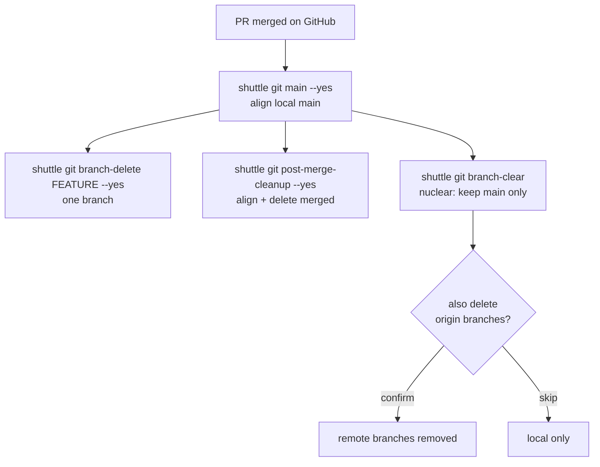
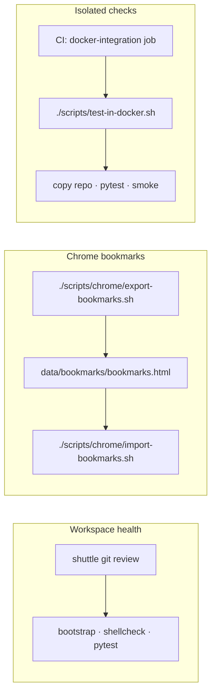
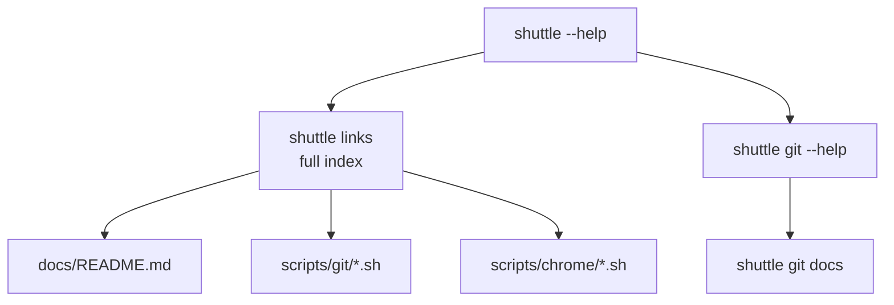

# Common usage flows

Visual maps for everyday `shuttle` workflows. Command details live in [git.md](git.md) and [quick-defaults.md](quick-defaults.md).

## Feature work (start → publish)

Default branch name and commit message — no prompts until push.

## Sync with main

Stay current while on a feature branch.

## Write gate (destructive / remote)

Read inventory first, then confirm before mutating.

Safe by default: `shuttle git start` does **not** reset or clean unless you pass `--align-main --yes`.

## After merge (cleanup)

## Health check & bookmarks

## Discover commands

See also: [Architecture](architecture.md) · [Docker integration](docker.md) · `shuttle links`
