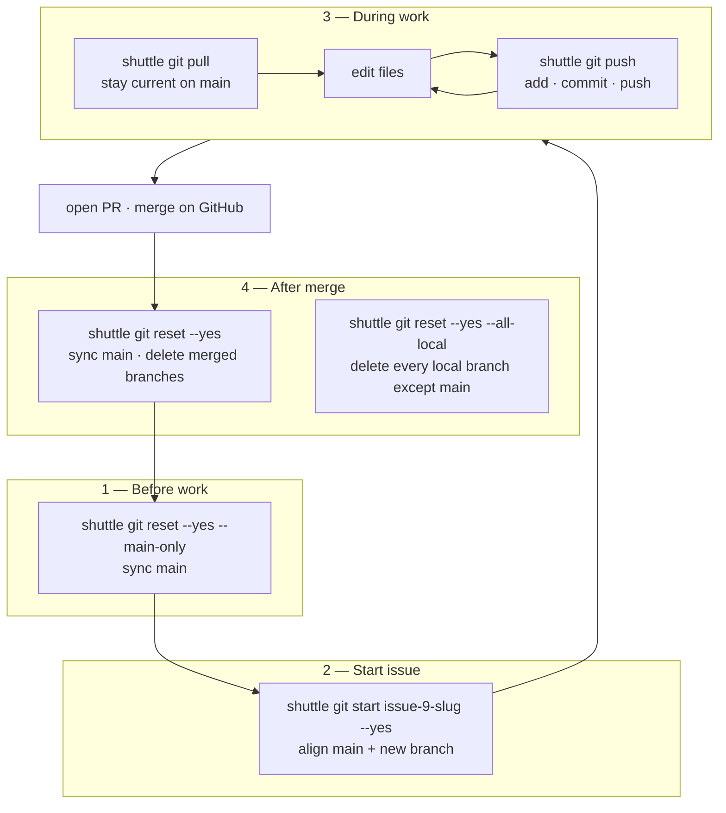
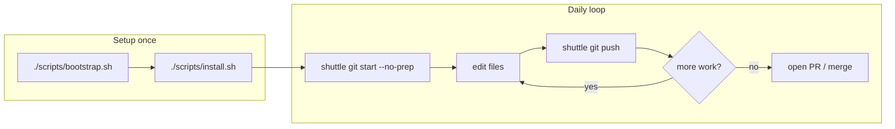
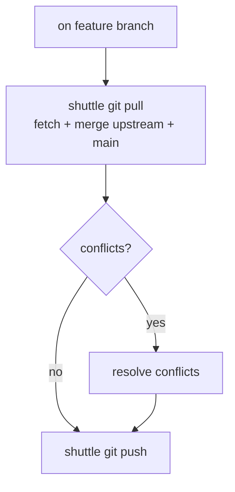
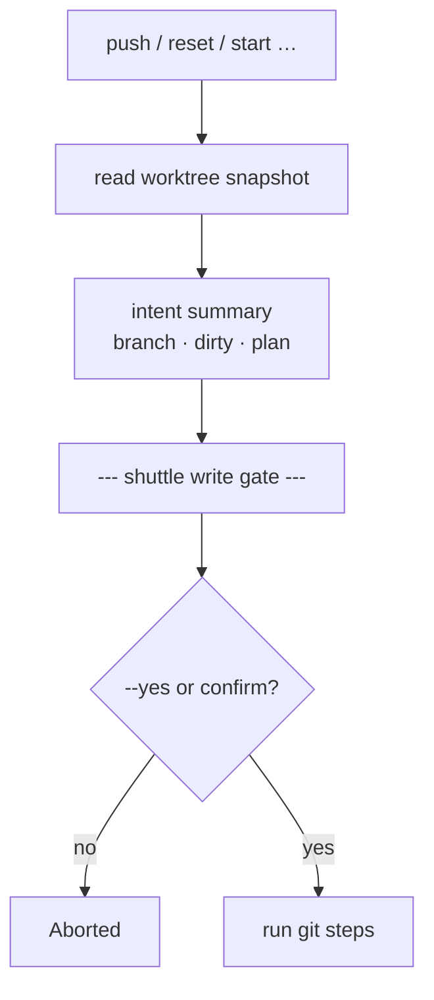
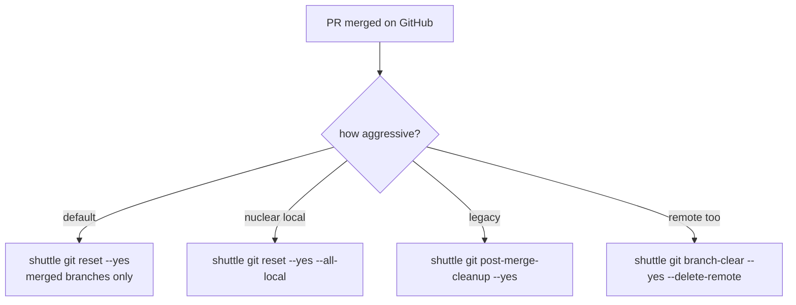
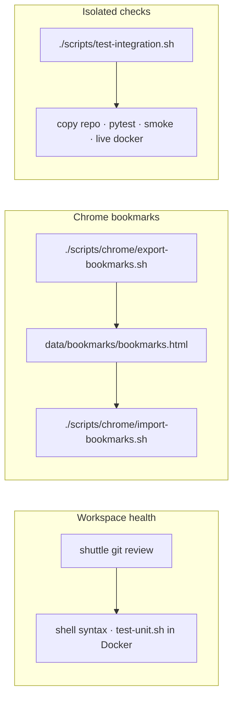
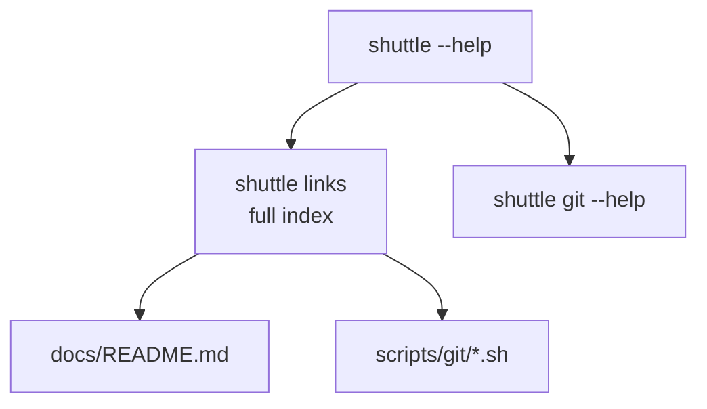

# Common usage flows

Visual maps for everyday `shuttle` workflows. Command details live in [git.md](git.md) and [quick-defaults.md](quick-defaults.md).

## Full issue lifecycle



| Phase | Shortcut | What it does | Older equivalent |
| --- | --- | --- | --- |
| Sync main | `git reset --yes --main-only` | checkout `main`, fetch, pull/ff or hard-reset, clean worktree | `git main --yes` |
| Start issue | `git start [branch] --yes` | align main + `checkout -b` | — |
| Publish WIP | `git push --yes` | add + commit + push current branch; on `main`, start random branch first | `git commit` + `git push` |
| Stay current | `git pull` | fetch + merge upstream/main into feature branch | — |
| After merge | `git reset --yes` | return to synced main + delete **merged** branches (+ remote) | `git post-merge-cleanup --yes` |
| Nuclear local | `git reset --yes --all-local` | synced main + delete **all** local branches except main | `git branch-clear --yes` |

All destructive steps show the **write gate** (branch, dirty state, intent) before running. Pass `--yes` / `-y` to skip the prompt (summary still prints).

**Leaving a feature branch:** `reset` commits uncommitted work on the current branch (message `.` by default) before syncing `main`. Pass `--discard` to drop uncommitted changes instead.

### Example session

```bash
# Monday: synced main
shuttle git reset --yes --main-only

# Pick up GitHub issue #9
shuttle git start issue-9-docker --yes

# Loop until PR is ready
shuttle git push          # interactive
shuttle git pull          # optional: merge latest main
shuttle git push --yes

# After PR merged
shuttle git reset --yes
```

## Feature work (start → publish)



## Sync with main (on feature branch)



## Write gate (destructive / remote)



## After merge (cleanup options)



## Health check & bookmarks



## Discover commands



See also: [Architecture](architecture.md) · [Docker integration](docker.md) · `shuttle links`
