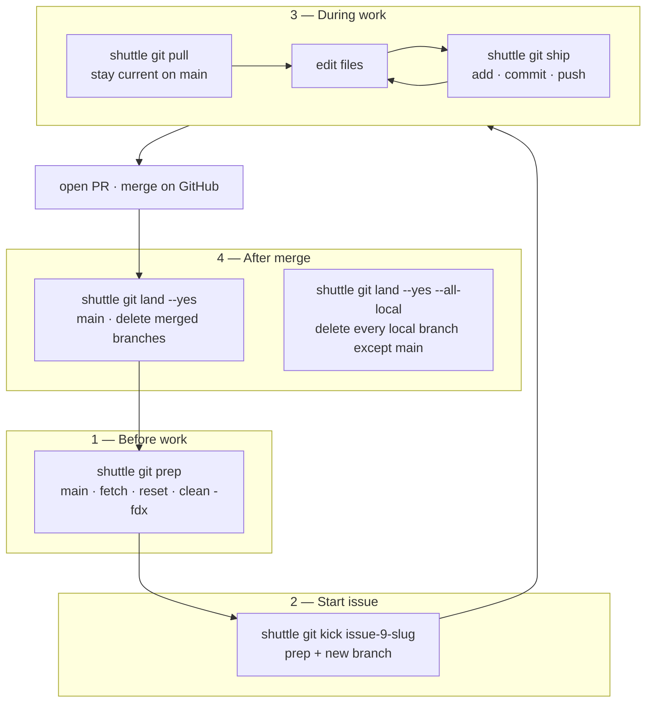
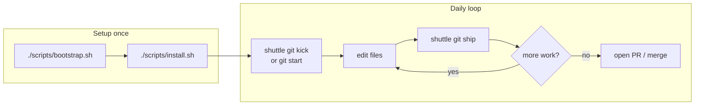
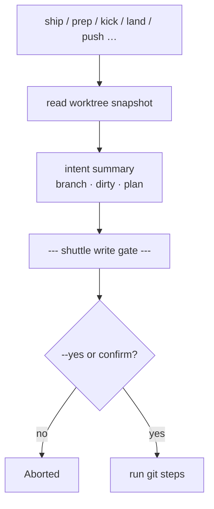
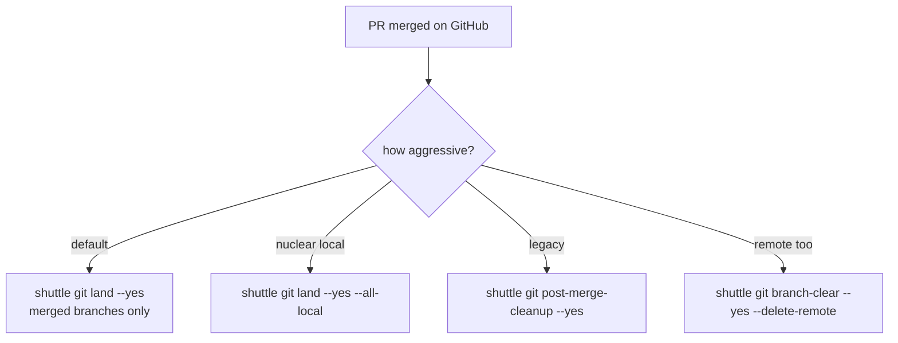
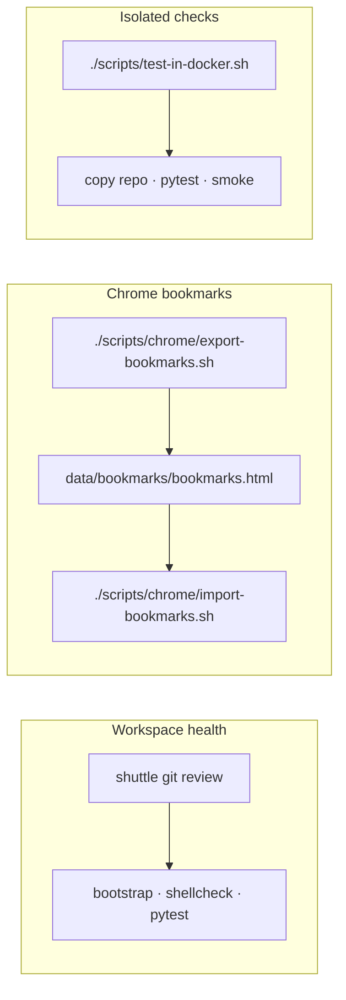
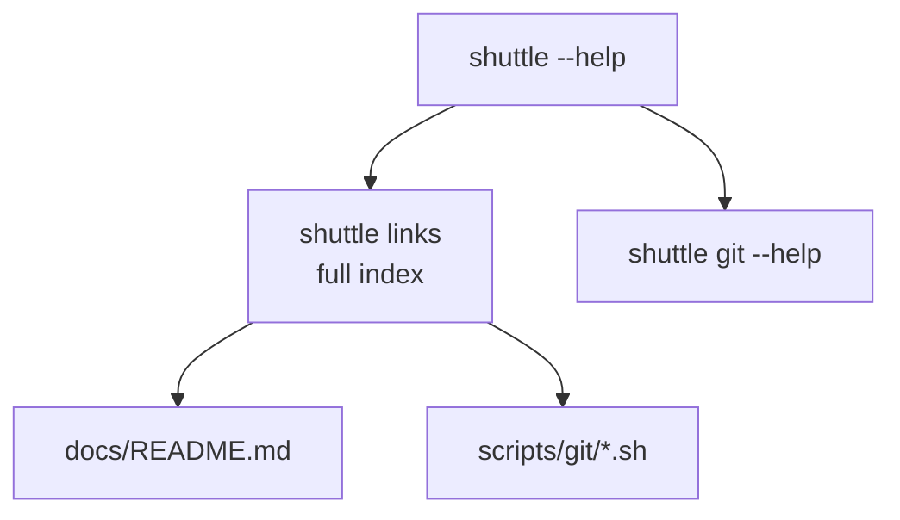

# Common usage flows

Visual maps for everyday `shuttle` workflows. Command details live in [git.md](git.md) and [quick-defaults.md](quick-defaults.md).

## Full issue lifecycle

The four workflow shortcuts map to how you actually work with GitHub issues:



| Phase | Shortcut | What it does | Older equivalent |
| --- | --- | --- | --- |
| Before work | `git prep` | `main` + fetch + reset --hard + clean -fdx | `git main --yes` |
| Start issue | `git kick [branch]` | prep + `checkout -b` | `git start --align-main --yes` |
| Publish WIP | `git ship` | add + commit + push (branch summary gate) | `git commit` + `git push --yes` |
| Stay current | `git pull` | fetch + merge upstream/main into feature branch | — |
| After merge | `git land` | prep + delete **merged** branches (+ remote) | `git post-merge-cleanup --yes` |
| Nuclear local | `git land --all-local` | prep + delete **all** local branches except main | `git branch-clear --yes` |

All destructive steps show the **write gate** (branch, dirty state, intent) before running. Pass `--yes` in scripts/CI.

### Example session

```bash
# Monday: clean slate
shuttle git prep --yes

# Pick up GitHub issue #9
shuttle git kick issue-9-docker --yes

# Loop until PR is ready
shuttle git ship          # interactive
shuttle git pull          # optional: merge latest main
shuttle git ship --yes

# After PR merged
shuttle git land --yes
```

## Feature work (start → publish)



## Sync with main (on feature branch)


## Write gate (destructive / remote)



## After merge (cleanup options)



## Health check & bookmarks



## Discover commands



See also: [Architecture](architecture.md) · [Docker integration](docker.md) · `shuttle links`
